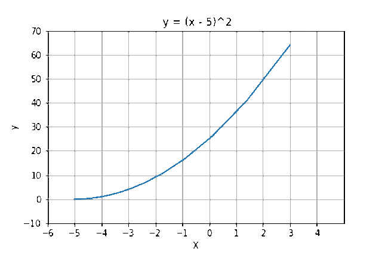

# Gradient Descent 

This is an implementation problem of Gradient Descent in which you can see the descendants of the point on the plane to reach the minima with the help of the graph through which you can understand the working of gradient descent with clarity.

## Initialization

<!--current point-->
`x0 = 3`
<!--learning rate -->
`lr = 0.01` 
<!-- derivation of funtion-->
`dy/dx = d/dx [(x+5)^2] = 2 * (x + 5)`

<!-- Iteration 1 : -->
`x1 = x0 - lr * dy/dx`
`x1 = 3 - (0.01) * (2* (3+5)) = 2.84`
<!-- Iteration 2 : -->
`x2 = x1 - lr * dy/dx`
`x2 = 2.84 - (0.01) * (2* (2.84 + 5)) = 2.68`

<!--.-->
<!--.-->
<!--.-->

## Can follow the blog :
[Gradient Descent Blog - Medium](https://medium.com/praemineo/gradient-descent-158ec196d02f?source=friends_link&sk=26857af7f597418674203aa665fbef3b)

